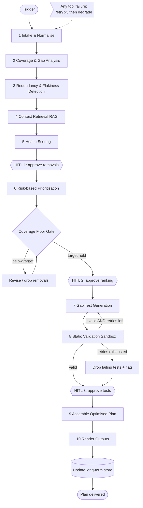

# Test Optimiser Agent — 15-Min Technical Walkthrough

> **Framework:** LangGraph · **Autonomy Level:** L3 · Goal-driven

---

## 1. What It Does

- Your test suite grows over time and becomes slow, messy, and untrustworthy — this agent cleans it up
- Looks at every test, scores it, and decides: is this test actually doing its job?
- Flags tests that are duplicated, randomly failing, too slow, or testing code that no longer exists
- Finds parts of your code that have no tests at all and writes new ones to fill those gaps
- Won't let coverage drop below your set limit no matter what it removes
- Stops and asks a human before doing anything that can't be undone

---

## 2. Autonomy — L3

- **L1** — you script every step
- **L2** — you give a task, it finds the steps
- **L3** — you give a goal, it finds the tasks and steps
- **L4** — sets its own goals

**Why L3:** You say "suite under 10 mins, above 80% coverage" — agent figures out how to get there, adapts to what data shows, but cannot do anything destructive without human sign-off

**Why not L2:** Diagnosing the problem IS what the agent does — you can't give it a specific task when you don't know what the task is yet

**Why not L4:** One wrong autonomous call on a test suite has real production consequences — agent owns the *how*, humans own the *what* and the *whether*

**Autonomy growth over time:**

| Stage | Trust earned | Unattended capability |
|-------|--------------|------------------------|
| 1 — Assistive | Day one | Recommends only |
| 2 — Semi-autonomous | Proven accurate per project | Auto-quarantines flaky tests (reversible) |
| 3 — Goal-autonomous | Sustained reliability | Auto-merges duplicates, auto-tiers suite |

- Destructive deletes stay human-gated permanently
- Autonomy expands on measured correction rate, not time elapsed

---

## 3. Inputs

- **Test suite** — the tests you already have, required to start
- **Project** — which codebase these tests belong to, required
- **Optimization goal** — what problem are you solving: speed, coverage, reliability, or cost
- **Coverage target** — the minimum % of code that must stay tested, defaults to 80%
- **Risk areas** — parts of the codebase that are sensitive, agent treads carefully here
- **Additional context** — anything extra the agent should know about your project

---

## 4. Outputs

- **Test Health Scorecard** — report card for your entire suite, scored across every dimension
- **Coverage & Gap Map** — shows exactly what's tested and what's a blind spot, sorted by how dangerous each gap is
- **Redundancy & Flakiness Report** — every problematic test called out with the evidence behind it
- **Optimised Test Plan** — every single test gets a verdict: keep it, merge it, quarantine it, or move it to a different tier
- **Generated Test Cases** — brand new tests written by the agent to plug the gaps it found
- **Context Sources** — everything the agent used to reach its conclusions, so you can verify its reasoning

---

## 5. Triggers

- **Manual** — you open it, paste your suite in, run it yourself when you want
- **API** — another system calls it automatically, no human clicks anything
- **Webhook** — it listens for events in your pipeline and fires on its own when:
  - Someone pushes new code
  - A pipeline fails
  - New requirements get added

---

## 6. Hardware

- Runs on normal cloud servers, nothing special needed
- The AI models themselves run elsewhere via API — not on this machine
- Needs to reach three things: your code repo, your CI system, and your past test run history
- One special piece: an isolated container where generated tests are run safely before touching anything real

---

## 7. Software Stack

- **LangGraph** — the traffic controller that runs the whole pipeline, handles pauses, loops, and decision points
- **Strong LLM** — used when real thinking is needed: explaining scores, writing test code, making prioritisation calls
- **Cheap LLM** — used for repetitive mechanical work: labelling, formatting, simple yes/no routing
- **Vector store** — a database that finds things by meaning, not just matching words
- **NLP layer** — handles bulk text work like extracting entities and matching meanings across thousands of tests cheaply
- **Test parsers** — translates every test framework's format into one language the agent can work with
- **Repo + Jira connectors** — how the agent actually reads your code and your tickets
- **Checkpointer** — saves everything when the agent pauses at a checkpoint, picks up exactly where it left off when a human responds
- **Sandbox executor** — runs generated tests in a sealed container so nothing can go wrong in your real system

**Why two LLMs:**
- One run can involve thousands of tests
- Using the expensive model for everything — including simple labelling tasks — would be slow and costly
- Cheap model handles the bulk repetitive passes
- Expensive model only gets called when the task genuinely needs reasoning

---

## 8. ADLC Journey

**Phase 0 — Discovery**
- The real problem wasn't missing tests — it was too many bad ones: slow, flaky, duplicated
- Agent won't start unless tests are version-controlled and have past run history to learn from

**Phase 1 — Scoping**
- Hard boundaries set before any code was written: can suggest removal not execute it, can write tests not commit them, cannot breach coverage floor
- Success metrics locked upfront: runtime ↓, redundancy ↓, flakiness rate ↓, coverage held, unapproved deletions = 0

**Phase 2 — Architecture**
- LLM routing: strong model for nodes 5 and 7, cheap model for classification, formatting, routing
- Memory: short-term typed state object per run, long-term per-project vector store updated after every run

**Phase 3 — Build & Test**
- Wired to real repos and CI history, not synthetic data — every node decision logged to audit trail
- Thumbs up/down collected at each HITL to build per-project correction dataset

**Phase 4 — Deployment**
- 5% rollout to one team, all actions reversible, HITL mandatory regardless of run_mode
- Blast radius contained until correction rate is measurably low

**Phase 5 — Continuous Improvement**
- Checks back monthly because codebases change and the suite drifts with them
- Every human correction gets stored — agent learns from it. Only gets more independence when the correction rate actually drops, not just because time passed

---

## 9. Architecture — Node by Node



---

### Node 1 — Intake & Normalise
- Tests arrive from different frameworks all in different formats — translates everything into one common representation
- Every downstream node works on this cleaned unified version, not the raw input
- NLP breaks test names and docstrings into clean tokens and reduces words to root forms
- NER pulls out exactly what each test is touching — which endpoint, which module, which function
- Runs across thousands of tests instantly at near-zero cost — LLM would be too slow and expensive here

---

### Node 2 — Coverage & Gap Analysis
- Checks which parts of your actual code each test exercises when it runs
- Matches each test to your requirements even when they're worded completely differently
- Anything with no test close to it gets flagged as a gap, sorted by how risky that blind spot is
- NLP converts both tests and requirements into embeddings, cosine similarity measures how close they are in meaning — above a threshold they get linked, giving a numeric confidence score not a guess
- NLP nearest-neighbour search finds requirements with no semantically close test — gaps ranked by distance, furthest from any existing test = most urgent blind spot

---

### Node 3 — Redundancy & Flakiness Detection
- Looks at past CI run history to find tests that randomly pass and fail = flaky
- Checks run times to flag slow tests, cross-references current codebase to flag tests covering deleted code
- Every flag comes with the evidence behind it, not just a label
- NLP embeds every test and uses agglomerative clustering to group semantically similar ones — catches duplicates that look completely different in wording but test the exact same thing
- NLP extracts signal from noisy CI logs via TF-IDF or embeddings, text classification labels each pattern as flaky or real failure — bulk processing without a separate LLM call per log line

---

### Node 4 — Context Retrieval (RAG)
- Before scoring anything, pulls relevant history from memory: past decisions, known patterns, project docs
- Runs before scoring so the LLM already has full context when it makes its calls
- Stops the agent from flagging something a human already decided to keep in a previous run
- NLP embeds the query and fires it against the vector store, returns the most semantically relevant prior decisions and docs
- Optional re-ranking sorts results by relevance before handing to the LLM — entirely embedding-based, no LLM cost at this step

---

### Node 5 — Health Scoring
- Takes everything from nodes 2, 3, and 4 and produces a score for every test across multiple dimensions
- Each score has a reason and a recommended action attached — not just a number
- Strong LLM used here because explaining why a test scored low needs actual reasoning not just calculation
- NLP signals from nodes 1–4 feed directly into scoring — LLM reasons over already-structured inputs, not raw text
- Result: LLM spends tokens on judgement, not on parsing — much cheaper and more accurate

---

### 🔴 HITL 1 — Approve Removals
- Pipeline completely stops via LangGraph `interrupt()`
- Agent surfaces which tests it wants to remove and exactly why — full evidence attached
- Human can approve, reject, or change each recommendation
- Checkpointer saves entire state — pause can last hours or days, resumes exactly where it left off
- Every human decision stored in long-term memory so it informs future runs

---

### Node 6 — Risk-based Prioritisation
- Re-sorts surviving tests into three tiers: Smoke (every commit), Regression (merges), Full (nightly/release)
- Which tier a test lands in is driven by the optimization goal: speed → thin smoke, coverage → broad regression, reliability → flaky tests demoted, cost → expensive tests pushed to nightly
- Tests covering risk areas always pinned to smoke regardless of speed — safety overrides efficiency
- No new NLP at this node — tiering decisions made by LLM reasoning over scores and flags already produced upstream
- Output feeds directly into the coverage floor gate before any human sees it

---

### 🟡 Coverage Floor Gate
- Recomputes projected coverage after approved removals are applied
- If above target → proceeds to HITL 2
- If below target → walks back the least valuable removals and re-checks, loops until floor is held
- Cannot be skipped — no change set that breaches the coverage floor passes through
- Risk area tests are pinned and never eligible for removal at this gate

---

### 🔴 HITL 2 — Approve Ranking
- Human reviews the proposed test tiering before it gets locked in
- Can adjust which tests sit in which tier
- State saved by checkpointer — pause can last as long as needed
- Approval stored in `approved_priority` field of the state object

---

### Node 7 — Gap Test Generation
- Strong LLM writes brand new test code for the top-ranked gaps found in Node 2
- Does not go anywhere near the real repo — output goes straight to sandbox
- Gap list it works from was produced by NLP in Node 2 — LLM takes over fully for generation
- If validation fails, this node is called again with the failure reason as additional context — up to 3 times
- `gen_retry_count` in state object tracks attempts and enforces the ceiling

---

### Node 8 — Static Validation Sandbox
- Generated tests run inside an isolated container completely cut off from real systems
- Three outcomes: valid → HITL 3, invalid with retries left → back to Node 7, retries exhausted → dropped and flagged
- After 3 failed attempts tests are dropped and flagged as needing manual attention — run always continues
- No NLP here — purely code execution and pass/fail evaluation
- Keeps bad generated code from ever reaching the real codebase at any point

---

### 🔴 HITL 3 — Approve Generated Tests
- Human reviews tests that passed sandbox validation
- Tests that failed all 3 attempts shown separately as needing manual work
- Nothing reaches the real repo until explicitly approved here
- State saved by checkpointer — approval stored in `approved_generated_tests` in state object

---

### Node 9 — Assemble Optimised Plan
- Pulls all approved decisions together: what's kept, removed, re-tiered, and newly generated
- Includes everything dropped or flagged so nothing is silently lost from the record
- No NLP here — purely assembly of decisions already made upstream
- Single coherent output that feeds directly into Node 10

---

### Node 10 — Render Outputs
- Produces all 6 deliverables and writes everything learned from this run into long-term memory
- Next run starts with this run's decisions already in context
- NLP step here: outputs and decisions get embedded and written back to the vector store
- This is what makes Node 4 smarter on every subsequent run — memory compounds over time
- Every degrade, flag, and approval from this run becomes retrievable context for the next

---

## 10. Typed State Schema

```python
from typing import TypedDict, Annotated, Literal
from operator import add

class TestOptimiserState(TypedDict):
    # --- Inputs ---
    project_id: str
    raw_suite: list[dict]
    optimization_goal: Literal["speed", "coverage", "reliability", "cost"]
    coverage_target: float                # default 0.80
    risk_areas: list[str]
    additional_context: str
    run_mode: Literal["interactive", "automated"]

    # --- Working state ---
    normalised_suite: list[dict]
    coverage_map: dict
    projected_coverage: float
    coverage_gaps: list[dict]
    redundancy_flags: list[dict]
    flakiness_flags: list[dict]
    retrieved_context: list[dict]
    scorecard: dict

    # --- Human decisions ---
    approved_removals: list[str]
    approved_priority: dict
    approved_generated_tests: list[dict]

    # --- Loop & error control ---
    gen_retry_count: int
    tool_errors: Annotated[list[dict], add]
    needs_regen: bool

    # --- Results ---
    prioritised_plan: dict
    generated_tests: list[dict]
    final_outputs: dict

    # --- Observability ---
    audit_log: Annotated[list[dict], add]
```

- Single state object flows through every node — each node reads what it needs and writes results back
- `tool_errors` and `audit_log` are append-only using `Annotated[list, add]` — they only ever grow, nothing is ever overwritten
- Human decisions captured at each interrupt are stored here and passed forward to all subsequent nodes
- `gen_retry_count` bounds the Node 7 → Node 8 loop — enforced in code not just convention

---

## 11. Blocker Fixes

### 1 · Bounded Validation Loop

```python
MAX_GEN_RETRIES = 3

def route_after_validation(state: TestOptimiserState) -> str:
    if state["validation_passed"]:
        return "approve_tests"
    if state["gen_retry_count"] >= MAX_GEN_RETRIES:
        return "drop_failing"
    return "gap_gen"
```

- Hard ceiling of 3 retries — loop cannot spin forever
- On each failure `gen_retry_count` increments inside `gap_gen`
- After 3 attempts failed tests are dropped, recorded in audit log, surfaced at HITL 3 as needing manual attention
- Run always proceeds regardless

### 2 · Enforced Coverage Floor Gate

```python
def coverage_floor_gate(state: TestOptimiserState) -> str:
    projected = recompute_coverage(state["normalised_suite"],
                                   state["approved_removals"])
    state["projected_coverage"] = projected
    if projected < state["coverage_target"]:
        return "revise"
    return "approve_ranking"
```

- Recomputes projected coverage after every removal set is applied
- Below target → routes to revise, walks back least-valuable removals, re-checks
- Cannot pass a change set that breaches the floor — enforced in code not prose
- Risk area tests pinned and never eligible for removal here

### 3 · Tool-call Error Handling

```python
def call_tool(fn, *args, retries=3, backoff=2):
    for attempt in range(retries):
        try:
            return {"ok": True, "data": fn(*args)}
        except TransientError:
            time.sleep(backoff ** attempt)
        except FatalError as e:
            return {"ok": False, "error": str(e)}
    return {"ok": False, "error": "max_retries_exceeded"}
```

| Failed dependency | Degrade behaviour |
|-------------------|-------------------|
| Coverage report | Falls back to static call-graph estimate, marked low-confidence |
| CI history | Flakiness flags downgraded to "needs more data" |
| Vector store | Proceeds with empty context, flagged as "context thin" |
| Sandbox | Skips generation, delivers analysis + plan only |
| Repo (fatal) | Halts cleanly — only case where stopping is correct |

- Every degrade appended to `tool_errors` and shown in final report
- Human always knows which results are full-confidence and which are degraded
- Transient errors: exponential backoff, 3 retries
- Fatal errors: no retry, immediate clean failure

---

## 12. Safety Controls

- Nothing destructive runs without explicit human approval at a HITL checkpoint
- Coverage floor enforced in code — hard block not a guideline
- Risk area tests permanently pinned, never eligible for removal
- Every action versioned and reversible — instant rollback available
- Full audit trail of every node, tool call, score, and approval throughout the run
- Generated tests only ever run in the sandbox, never against real systems
- Gradual rollout starting at 5% / one team

---


