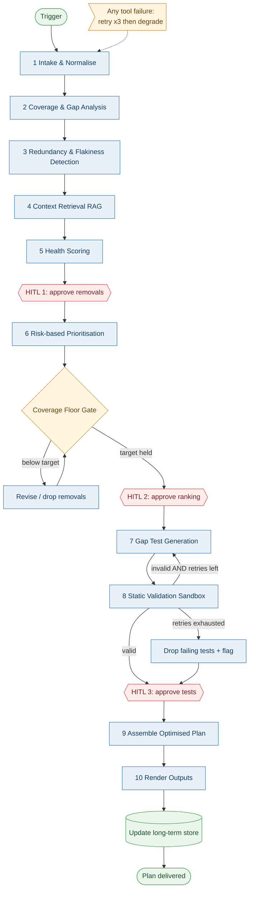

# Test Optimiser Agent

> **Framework:** LangGraph · **Autonomy Level:** L3 · Goal-driven

---

## Behavior

Takes an existing test suite and makes it leaner, faster, and more reliable without losing coverage. It scores the suite, maps coverage against code and acceptance criteria, flags tests that are redundant, flaky, slow, or obsolete, re-prioritises what remains, and drafts new tests for genuine gaps. It pauses for human approval at three points: before quarantining/removing tests, before locking the priority ranking, and before committing generated tests.

## Autonomy Level — L3 · Goal-driven

You give it a goal ("get this suite under 10 minutes without dropping below 80% coverage"), not a script. It plans its own steps and tool calls, but stops at checkpoints for sign-off on anything destructive. It can *recommend* removing a test, never delete one unattended.

## Inputs

Test suite (required), project (required), optimization goal (speed / coverage / reliability / cost), coverage target (default 80%), risk areas to protect, and any additional context.

## Outputs

Test Health Scorecard, Coverage & Gap Map, Redundancy & Flakiness Report, an Optimised Test Plan (keep / merge / quarantine / re-tier), generated test cases for gaps, and context sources.

## Triggers

Manual (paste in workspace), API (programmatic), Webhook (CI on new commit, failed pipeline, or new acceptance criteria).

## Hardware

Standard cloud compute — no GPU needed for the agent itself (model inference is API-hosted). Requires connectivity to the code repo, CI/test-management systems, and a historical test-run datastore. An isolated sandbox container is used for static validation of generated tests.

## Software

LangGraph orchestration; a hosted LLM (reasoning + a cheaper fast model); a vector store for retrieval; an **NLP layer** (sentence-embedding model for semantic similarity, plus tokenisation/NER/keyword-extraction, e.g. spaCy or sentence-transformers); coverage-report and multi-framework test parsers (pytest, JUnit, Jest, Cypress); repo and Jira/test-management connectors; a checkpointer for pause/resume; and a sandboxed code executor.

---

## ADLC Journey

**Phase 0 — Discovery.** We confirmed the real problem isn't "too few tests" but slow, untrusted suites full of flaky, redundant tests — and that optimising a broken process only breaks it faster. Precondition set: tests must be version-controlled with some run history.

**Phase 1 — Scoping.** It fits *after* tests exist, *before* CI runs them. It recommends but never deletes, drafts but never commits, and never drops below the coverage target. Success = runtime down, redundancy down, flakiness down, coverage held, zero unapproved deletions.

**Phase 2 — Architecture.** Brain: route reasoning-heavy work to a strong model, mechanical passes to a cheap one. Memory: short-term run state plus per-project long-term store. Tools: repo, coverage, CI history, vector store, sandbox.

**Phase 3 — Build & Test.** Wire to real data, log every decision and tool call, collect thumbs up/down. The goal is reliability, not just a working demo.

**Phase 4 — Deployment.** Gradual rollout from 5%, reversible actions, humans approve anything high-stakes.

**Phase 5 — Continuous Improvement.** Re-scan monthly for drift, feed feedback into memory, expand autonomy as trust grows.

---

## LangGraph Architecture



A single typed **state object** flows through the graph (defined below). The analysis spine (intake → coverage → redundancy → retrieval → scoring) is linear. The three red diamonds are LangGraph `interrupt()` calls — the graph pauses, surfaces evidence, and resumes on human input. The amber **coverage-floor gate** blocks any change set that would drop below the target, and the `validate → gap_gen` loop is **capped at 3 retries** before falling back to dropping failing tests. Every tool call has a retry/degrade path (see Blocker Fixes). A checkpointer persists state so each pause can wait indefinitely and resume exactly where it stopped.

**The 10 nodes, briefly:** (1) parse heterogeneous test formats into one representation; (2) map coverage and rank gaps by risk; (3) flag duplicate/flaky/slow/obsolete tests with evidence; (4) retrieve project context and prior decisions; (5) produce the health scorecard; (6) re-tier the suite (smoke → regression → full) by risk and goal; (7) draft tests for top gaps; (8) statically validate them in a sandbox; (9) assemble the final plan; (10) render outputs and update memory.

---

## Where NLP Is Used (not just the LLM)

The LLM handles judgement and generation, but several steps are better served by dedicated NLP techniques running on top of the existing vector store. This is cheaper, more deterministic, and more explainable than asking the LLM to eyeball everything.

| Where | Task | NLP technique | Why not just the LLM |
|-------|------|---------------|----------------------|
| Node 1 — Intake | Normalise test names/docstrings; pull out the entities a test touches (endpoint, module, function). | Tokenisation, lemmatisation, **Named Entity Recognition** + rule/keyword extraction. | Deterministic parsing; no token cost on thousands of tests. |
| Node 2 — Coverage & Gap | Match each test to the acceptance criterion it satisfies. | **Semantic Textual Similarity** — embed test + criterion, cosine similarity, threshold to link. | Scales to many-to-many matching; gives a numeric confidence, not a vibe. |
| Node 2 — Gap analysis | Find criteria/code paths with *no* semantically close test. | Embedding **coverage / nearest-neighbour search** in the vector store; low max-similarity = a gap. | Surfaces gaps quantitatively and ranks them by distance. |
| Node 3 — Redundancy | Detect duplicate / overlapping tests. | Embedding similarity + **cosine threshold + clustering** (e.g. agglomerative) to group near-duplicates. | Catches *semantic* duplicates that differ in wording but test the same thing. |
| Node 3 — Flakiness triage | Group and label recurring CI failure messages. | **Text classification + keyword/log-pattern extraction** (TF-IDF / embeddings) on failure logs. | Turns noisy logs into structured "flaky vs. real" signals without an LLM call per failure. |
| Node 4 — Retrieval | Pull relevant docs/prior decisions. | **Dense embedding retrieval** (the vector store) + optional re-ranking. | This is the core RAG step — already embedding-based. |

The LLM is then reserved for what genuinely needs reasoning: explaining *why* a test scored low, prioritisation trade-offs, and drafting new test code. NLP narrows the field; the LLM makes the calls.

---

## Typed State Schema

A single state object is threaded through every node. Each node reads what it needs and writes back its results.

```python
from typing import TypedDict, Annotated, Literal
from operator import add

class TestOptimiserState(TypedDict):
    # --- Inputs ---
    project_id: str
    raw_suite: list[dict]                 # tests as ingested
    optimization_goal: Literal["speed", "coverage", "reliability", "cost"]
    coverage_target: float                # default 0.80
    risk_areas: list[str]
    additional_context: str
    run_mode: Literal["interactive", "automated"]   # webhook/API => automated

    # --- Working state (written by nodes) ---
    normalised_suite: list[dict]
    coverage_map: dict                    # test_id -> covered paths / criteria
    projected_coverage: float             # coverage if proposed changes applied
    coverage_gaps: list[dict]             # uncovered paths, ranked by risk
    redundancy_flags: list[dict]
    flakiness_flags: list[dict]
    retrieved_context: list[dict]         # RAG results w/ relevance scores
    scorecard: dict                       # per-dimension score + reason + action

    # --- Human decisions (captured at interrupts) ---
    approved_removals: list[str]
    approved_priority: dict
    approved_generated_tests: list[dict]

    # --- Loop & error control ---
    gen_retry_count: int                  # bounds the validation loop
    tool_errors: Annotated[list[dict], add]   # degraded/failed tool calls
    needs_regen: bool

    # --- Results ---
    prioritised_plan: dict
    generated_tests: list[dict]
    final_outputs: dict

    # --- Observability (append-only) ---
    audit_log: Annotated[list[dict], add]
```

---

## Blocker Fixes

### 1 · Bounded validation loop

The `validate → gap_gen` loop now has a hard ceiling and a fallback, so it can never spin forever.

```python
MAX_GEN_RETRIES = 3

def route_after_validation(state: TestOptimiserState) -> str:
    if state["validation_passed"]:
        return "approve_tests"          # -> HITL 3
    if state["gen_retry_count"] >= MAX_GEN_RETRIES:
        return "drop_failing"           # fallback: drop + flag, continue run
    return "gap_gen"                    # retry, count incremented in gap_gen
```

On each failed validation, `gen_retry_count` increments inside `gap_gen`. After 3 attempts the still-invalid tests are dropped, recorded in the audit log, and surfaced to the human at HITL 3 as "could not auto-generate — manual attention needed." The run always proceeds.

### 2 · Enforced coverage-floor gate

The coverage floor is no longer prose — it's a real gate node between prioritisation and HITL 2 that *blocks* any change set projected to fall below the target.

```python
def coverage_floor_gate(state: TestOptimiserState) -> str:
    projected = recompute_coverage(state["normalised_suite"],
                                   state["approved_removals"])
    state["projected_coverage"] = projected
    if projected < state["coverage_target"]:
        # revert the smallest set of removals needed to climb back over the line
        return "revise"                 # loop back, relax removals
    return "approve_ranking"            # -> HITL 2
```

The gate recomputes projected coverage after removals are applied. If it's below target it routes to a `revise` step that pares back the least-valuable removals and re-checks — it cannot pass a change that breaches the floor. Risk-Area tests are pinned and never eligible for removal here.

### 3 · Tool-call error handling

Every external call (repo, coverage report, CI history, vector store) is wrapped with bounded retries and a defined degrade path, so one failed dependency doesn't crash the graph.

```python
def call_tool(fn, *args, retries=3, backoff=2):
    for attempt in range(retries):
        try:
            return {"ok": True, "data": fn(*args)}
        except TransientError:
            time.sleep(backoff ** attempt)      # exponential backoff
        except FatalError as e:
            return {"ok": False, "error": str(e)}   # no retry on fatal
    return {"ok": False, "error": "max_retries_exceeded"}
```

**Degrade rules (not crash):**

| Failed dependency | Degrade behaviour |
|-------------------|-------------------|
| Coverage report unavailable | Fall back to static call-graph estimate; mark coverage as *low-confidence*. |
| CI history unavailable | Flakiness flags downgraded to "needs more data" rather than asserted. |
| Vector store / retrieval fails | Proceed with empty context; note "context thin" in outputs. |
| Sandbox unavailable | Skip generation; deliver analysis + plan only, flag generation as deferred. |
| Repo unreadable (fatal) | Halt cleanly with a clear error; never produce a partial plan silently. |

Every degrade is appended to `tool_errors` and shown in the final report, so the human always knows which results are full-confidence and which are degraded.

---

## Safety Controls

- Nothing destructive is automatic — removals, merges, and commits all need human sign-off.
- Hard coverage floor — never proposes changes that breach the target.
- Risk Areas are always escalated, never touched silently.
- All proposed actions are versioned and reversible (instant rollback).
- Full audit trail of every node, tool call, score, and approval.
- Generated tests run only in an isolated sandbox, never against production.
- Gradual rollout starting at 5% / one team.

---

## How Autonomy Builds Over Time

| Stage | Trust earned | Unattended capability |
|-------|--------------|------------------------|
| 1 — Assistive | Day one | Recommends only; every change approved by a human. |
| 2 — Semi-autonomous | Proven accurate per project | Auto-quarantines clearly flaky tests (reversible). |
| 3 — Goal-autonomous | Sustained reliability | Auto-merges trivial duplicates and auto-tiers the suite; destructive deletes still gated. |
