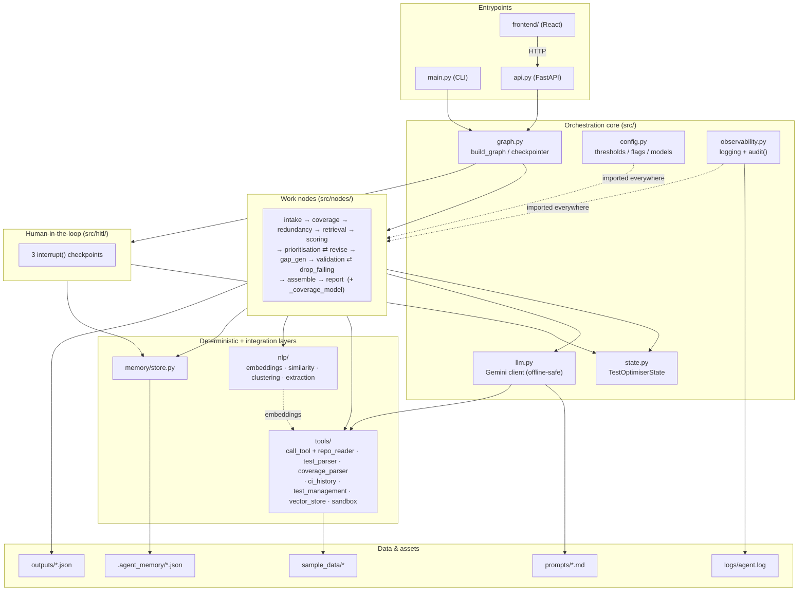
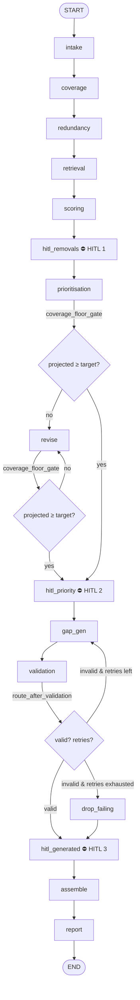

# Architecture (Detailed)

A deep architectural view of the Test Optimiser Agent, tracing the system from the entrypoints
through the graph, nodes, tools, and out to the written deliverables. Companion docs:
[EXECUTION_FLOW.md](EXECUTION_FLOW.md) (runtime order), [DATA_FLOW.md](DATA_FLOW.md) (data
movement), [STATE_FLOW.md](STATE_FLOW.md) (per-key state lifecycle),
[FUNCTION_CALL_MAP.md](FUNCTION_CALL_MAP.md) (every function).

> Provider note: LLM judgement is **Google Gemini (`gemini-2.5-flash`)** via `src/llm.py`.
> Everything runs **offline** with deterministic fallbacks when no key is configured.

---

## 1. The 30,000-ft view

```
main.py ─┐                                            ┌─▶ outputs/*.json
         ├─▶ src/graph.py: build_graph() ─▶ compiled ─┤
api.py ──┘        (StateGraph over            graph   └─▶ logs/agent.log
frontend/ ─HTTP─▶ TestOptimiserState)                 └─▶ HTTP JSON / .agent_memory/
```

Two thin entrypoints (`main.py` CLI, `api.py` HTTP) build **one** compiled LangGraph and invoke
it. The graph is a state machine over a single typed `TestOptimiserState`; each node returns only
the keys it changed and LangGraph merges them. External I/O is quarantined behind
`src/tools/call_tool`; deterministic text work is in `src/nlp/`; the LLM is reached only through
`src/llm.py`; long-term facts live in `src/memory/`.

---

## 2. Layered component architecture



**Dependency direction:** entrypoints → graph → nodes → (tools/nlp/llm/memory/hitl) → data.
`config` and `observability` are cross-cutting (imported almost everywhere). Nothing in `nodes/`
imports an SDK, file, or HTTP client directly — that is the whole point of the `tools/` layer.

---

## 3. The compiled graph (topology)



Registered in `src/graph.py`: **10 work nodes** (`intake, coverage, redundancy, retrieval,
scoring, prioritisation, gap_gen, validation, assemble, report`), **2 auxiliary nodes**
(`revise`, `drop_failing`), and **3 HITL nodes** (`hitl_removals, hitl_priority, hitl_generated`).
Two routing functions (`coverage_floor_gate`, `route_after_validation`) drive the conditional
edges. A checkpointer persists state so the three `interrupt()`s can pause/resume.

---

## 4. Module dependency graph (imports)

```mermaid
flowchart LR
    main --> graph
    api --> graph
    api --> llm
    graph --> nodes
    graph --> hitl
    graph --> state
    nodes --> tools
    nodes --> nlp
    nodes --> llm
    nodes --> memory
    nodes --> cfg[config]
    nodes --> obs[observability]
    nodes --> hitl
    hitl --> memory
    hitl --> obs
    llm --> tools
    llm --> cfg
    tools --> nlp
    tools --> cfg
    tools --> obs
    nlp --> cfg
    memory -.->|"stdlib only"| memory
```

Key edges worth remembering:
- `llm.py` imports `TransientError`/`FatalError` from `tools/tool_wrapper.py` (error taxonomy),
  and LLM calls are themselves wrapped by `call_tool` inside scoring/gap-generation.
- `nodes/prioritisation.py` and `nodes/coverage` import `is_protected` from `hitl/interrupts.py`
  and `coverage_for` from `nodes/_coverage_model.py` (shared math with the floor gate).
- `tools/vector_store.py` imports `nlp/embeddings` (cosine/embed) — the one tools→nlp edge.

---

## 5. Component responsibilities (at a glance)

| Component | Responsibility | Key symbols |
|-----------|----------------|-------------|
| `main.py` | CLI drive: build → invoke → answer interrupts → write outputs | `run`, `initial_state`, `_answer_interrupt`, `write_outputs` |
| `api.py` | HTTP drive: `/runs`, `/runs/{id}/resume`, `/runs/{id}`, `/health` | `_package`, `_config` |
| `src/graph.py` | wire nodes/edges/routing/loops + checkpointer | `build_graph`, `make_checkpointer` |
| `src/state.py` | the shared typed clipboard | `TestOptimiserState` |
| `src/config.py` | every threshold/flag/model; `.env` + truststore | `MAX_GEN_RETRIES`, `DEFAULT_COVERAGE_TARGET`, `OFFLINE_MODE`, … |
| `src/llm.py` | single Gemini client, offline-safe, JSON extraction | `complete`, `llm_available`, `extract_json`, `load_prompt` |
| `src/observability.py` | logging + append-only audit trail | `configure_logging`, `get_logger`, `audit` |
| `src/nodes/` | the analysis pipeline (see §3) | 10 nodes + 2 aux + 2 routers + `_coverage_model` |
| `src/tools/` | all external I/O behind `call_tool` | `call_tool`, `repo_reader`, `sandbox`, … |
| `src/nlp/` | deterministic matching/dedup/gaps/triage | `similarity`, `clustering`, `embeddings`, `extraction` |
| `src/hitl/` | 3 approval interrupts + `is_protected` | `hitl_*_node`, `_decision`, `is_protected` |
| `src/memory/` | durable per-project decisions/protected/flaky | `store.*` |

---

## 6. Safety controls baked into the architecture

These are structural, not advisory (each has a regression test in `tests/`):

1. **Bounded generation loop (Blocker #1)** — `route_after_validation` caps the
   `gap_gen ⇄ validation` loop at `MAX_GEN_RETRIES=3`, then `drop_failing` proceeds.
2. **Coverage-floor gate (Blocker #2)** — `coverage_floor_gate` is a real routing node that
   blocks any removal set projected below `coverage_target` and loops through `revise`
   (defensively capped by `MAX_REVISE_ITERS=10`).
3. **Degrade, never crash (Blocker #3)** — every external call goes through `call_tool`, which
   retries transient failures and returns a uniform envelope; nodes record a `tool_error` and
   fall back deterministically.
4. **Recommend, never delete** — nothing destructive happens without a human decision written at
   a HITL checkpoint; pinned (`is_protected`) tests are never even proposed for removal.
5. **Sandbox only** — generated tests get a subprocess **syntax check**, never execution against
   production (`tools/sandbox.py`).
6. **No faked data** — missing inputs yield "insufficient evidence" / `null`, never a guessed score.
7. **Append-only observability** — `audit_log` and `tool_errors` use `Annotated[list, add]`.

---

## 7. Deployment shapes

| Shape | Entrypoint | Checkpointer | HITL |
|-------|-----------|--------------|------|
| CLI (interactive) | `main.py` | `MemorySaver` | stdin prompts |
| CLI (automated) | `main.py --run-mode automated` | `MemorySaver` | auto-approve recommended |
| Web demo | `api.py` + `frontend/` | `MemorySaver` (or `SqliteSaver` via `CHECKPOINT_DB`) | approval cards |
| Tests | `tests/` | `MemorySaver` | auto-answered |

`make_checkpointer()` upgrades to `SqliteSaver` when `CHECKPOINT_DB` is set (persisting paused
runs across restarts), and falls back to in-memory if the optional package is missing.
