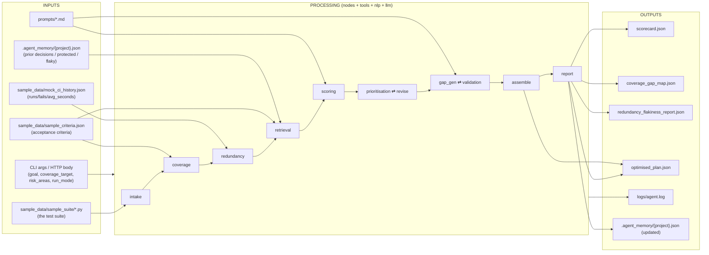
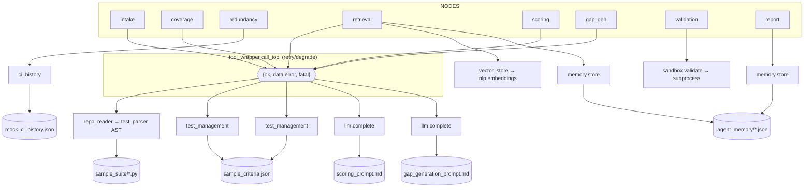

# Data Flow

How data enters the system, is transformed by each node's tools/NLP/LLM, accumulates in the
shared state, and leaves as the four deliverables. Focus: **inputs → transformations → outputs**,
and for every node the **tools used** and **files invoked**. Companion docs:
[EXECUTION_FLOW.md](EXECUTION_FLOW.md), [STATE_FLOW.md](STATE_FLOW.md),
[FUNCTION_CALL_MAP.md](FUNCTION_CALL_MAP.md).

---

## 1. End-to-end data movement



Data crosses three transformation layers on the way through each node:
`tools/` (raw I/O) → `nlp/` (deterministic structure) → `llm/` (judgement, optional).

---

## 2. Inputs (sources of truth)

| Input | Path | Read by | Shape |
|-------|------|---------|-------|
| Test suite | `sample_data/sample_suite/*.py` | `intake` → `repo_reader.read_tests` → `test_parser` (AST) | `[{id, name, docstring, framework, file, source, entities?, unparseable?}]` |
| Acceptance criteria | `sample_data/sample_criteria.json` (`"criteria"`) | `coverage`, `retrieval` → `test_management.get_acceptance_criteria` | `[{id, text}]` |
| CI history | `sample_data/mock_ci_history.json` | `redundancy` → `ci_history.get_history` | `{test_id: {runs, fails, avg_seconds}}` |
| Prompt templates | `prompts/scoring_prompt.md`, `prompts/gap_generation_prompt.md` | `scoring`, `gap_gen` → `llm.load_prompt` | Markdown |
| Long-term memory | `.agent_memory/{project_id}.json` | `retrieval`, `hitl_*`, `report` → `memory.store` | `{decisions, protected_tests, known_flaky}` |
| Run parameters | CLI args / HTTP body | entrypoints → `initial_state` | goal, coverage_target, risk_areas, run_mode, project_id |

---

## 3. Per-node data transformation (tools + files)

| Node | Consumes (data) | Tools invoked | Files invoked | Produces (data) |
|------|-----------------|---------------|---------------|-----------------|
| `intake` | suite path | `repo_reader.read_tests` *(call_tool)*, `repo_reader.detect_conventions`, `nlp.extraction.extract_entities` | `sample_data/sample_suite/*.py` | `normalised_suite`, `conventions` |
| `coverage` | `normalised_suite`, `risk_areas` | `test_management.get_acceptance_criteria` *(call_tool)*, `nlp.similarity.match_tests_to_criteria`/`find_gaps`, `_coverage_model.coverage_for` | `sample_data/sample_criteria.json` | `coverage_map`, `coverage_gaps`, `projected_coverage` |
| `redundancy` | `normalised_suite` | `nlp.clustering.cluster_duplicates`, `ci_history.get_history` | `sample_data/mock_ci_history.json` | `redundancy_flags`, `flakiness_flags`, `slow_flags` |
| `retrieval` | `normalised_suite`, `project_id` | `test_management.get_acceptance_criteria` *(call_tool)*, `vector_store.upsert`/`query`, `memory.get_prior_decisions`/`get_protected_tests` | `sample_data/sample_criteria.json`, `.agent_memory/{project}.json` | `retrieved_context` |
| `scoring` | coverage/redundancy/flaky/slow data | `llm.complete`/`extract_json`/`llm_available`/`load_prompt` *(call_tool)* | `prompts/scoring_prompt.md` | `scorecard` |
| `hitl_removals` | flaky/redundancy flags | `interrupt()`, `is_protected`→`memory.get_protected_tests` | `.agent_memory/{project}.json` | `approved_removals` |
| `prioritisation` | surviving suite, flags, goal | `_coverage_model.coverage_for`, `is_protected` | — | `prioritised_plan`, `projected_coverage` |
| `revise` | removals, redundancy | `_coverage_model.coverage_for`, `is_protected` | — | revised `approved_removals`, `projected_coverage` |
| `hitl_priority` | `prioritised_plan` | `interrupt()` | — | `approved_priority` |
| `gap_gen` | `coverage_gaps`, `conventions` | `llm.complete`/`llm_available`/`load_prompt` *(call_tool)* | `prompts/gap_generation_prompt.md` | `generated_tests` |
| `validation` | `generated_tests` | `sandbox.validate` (subprocess) | — (spawns Python) | validated `generated_tests` |
| `drop_failing` | `generated_tests` | — | — | pruned `generated_tests` |
| `hitl_generated` | `generated_tests` | `interrupt()` | — | `approved_generated_tests` |
| `assemble` | suite, removals, plan, generated | — | — | `final_outputs.optimised_plan` |
| `report` | all analysis + approvals | `memory.save_decision`/`record_flaky` | `.agent_memory/{project}.json` | all 4 deliverables |

*(call_tool)* = wrapped by `src/tools/tool_wrapper.call_tool` (retry/degrade envelope).

---

## 4. The tools → data layer



Note the **degrade paths**: if `call_tool` returns `ok:false`, the node appends a
`tool_error_entry` and continues on a deterministic fallback (empty criteria, lexical similarity,
rubric scorecard, stub test). Data always flows forward — the run never stalls on a failed tool.

---

## 5. Outputs (deliverables)

All four are assembled into `state["final_outputs"]` by `assemble`/`report`, written to disk by
`main.write_outputs()`, and returned verbatim over HTTP by `api.py`. Full field reference:
[OUTPUTS.md](OUTPUTS.md).

| File | Built by | Key structure | Frontend tab |
|------|----------|---------------|--------------|
| `scorecard.json` | `report` ← `scoring` | `{dimension: {score:int\|null, reason, action}}` × 6 | Health Scorecard |
| `coverage_gap_map.json` | `report` ← `coverage` | `{coverage_map, gaps[], projected_coverage}` | Coverage Map |
| `redundancy_flakiness_report.json` | `report` ← `redundancy` | `{redundancy_flags[], flakiness_flags[], slow_flags[]}` | Redundancy & Flakiness |
| `optimised_plan.json` | `assemble` | `{current, proposed{removed,merged,tiers,generated,kept}, projected_coverage, goal}` | Optimised Plan |

Side outputs: `logs/agent.log` (every `audit()` call), and the updated
`.agent_memory/{project}.json` (decisions + confirmed-flaky tests persisted by `report`).

---

## 6. Worked example (the sample fixture)

```
INPUT  sample_suite/ (23 pytest tests) + sample_criteria.json (AC-1..AC-7) + mock_ci_history.json
  │
intake      → 23 normalised tests (0 unparseable), conventions={framework: pytest}
coverage    → coverage_map(AC-1..AC-5 covered), gaps=[AC-6, AC-7], projected≈0.98
redundancy  → 2 near-duplicate clusters, 2 flaky, 2 slow (with evidence)
retrieval   → context hits (thin on first run), prior decisions from memory
scoring     → 6-dim scorecard (llm or rubric)
HITL 1      → approve removals (pinned "payment" tests excluded)
prioritise  → tiers {smoke, regression, full}; gate confirms projected ≥ 0.80
HITL 2      → approve ranking
gap_gen     → drafts tests for AC-6, AC-7 → validation (sandbox syntax check)
HITL 3      → approve generated tests
assemble    → optimised_plan (current 23 → proposed kept/removed/generated)
report      → 4 deliverables written; decisions + confirmed flaky saved to memory
  │
OUTPUT outputs/{scorecard,coverage_gap_map,redundancy_flakiness_report,optimised_plan}.json
```

---

## 7. Data-debugging locations

| Data looks wrong | Where it was produced |
|------------------|-----------------------|
| Missing/extra tests | `intake` + `test_parser._parse_pytest` (AST) + `unparseable` markers |
| No/incorrect coverage links | `coverage` + `nlp/similarity` thresholds; check `sample_criteria.json` |
| Wrong flaky/slow flags | `redundancy` + `mock_ci_history.json` + `FLAKY_FAIL_RATE`/`SLOW_TEST_SECONDS` |
| Empty retrieval | `retrieval` + `vector_store`/`nlp.embeddings` (offline mode) |
| Scores null/"insufficient evidence" | intended when evidence absent; check `scoring` inputs |
| Deliverable empty on disk | `report`/`assemble` state reads + `main.write_outputs` |
