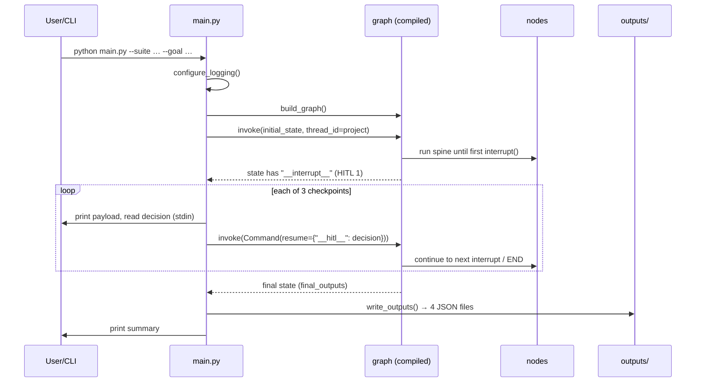
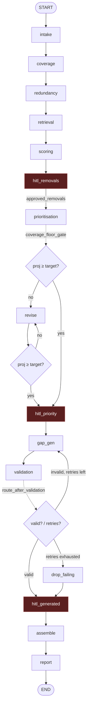
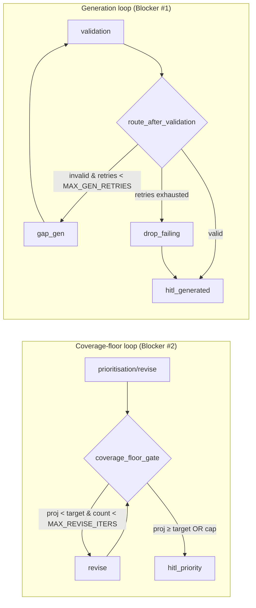

# Execution Flow

The runtime order of operations, node by node, from `main.py` through `graph.py` into the nodes,
their tools, and out to `outputs/`. For each node: **previous node · next node · input state ·
output state · tools used · files invoked**. Companion docs: [DATA_FLOW.md](DATA_FLOW.md),
[STATE_FLOW.md](STATE_FLOW.md), [FUNCTION_CALL_MAP.md](FUNCTION_CALL_MAP.md).

---

## 1. Top-level drive

**HTTP variant (`api.py`):** `POST /runs` invokes the graph and **blocks to the next checkpoint**,
returning `{status: "awaiting_approval", checkpoint, payload}`. The frontend renders the card,
then `POST /runs/{id}/resume` sends `{decision}` (wrapped `{"__hitl__": …}`) and the graph runs to
the next checkpoint. After the third resume the response is `{status: "completed", outputs}`.

---

## 2. Full execution graph

Linear spine: `intake → coverage → redundancy → retrieval → scoring`. Then interrupt 1, the
prioritisation + coverage-floor loop, interrupt 2, the generation/validation loop, interrupt 3,
and finally `assemble → report → END`.

---

## 3. Node-by-node reference

Legend — **In** = state keys read; **Out** = state keys written; **Tools** = functions called
(via `call_tool` where noted); **Files** = files/paths touched.

### Node 1 — `intake` (`src/nodes/intake.py :: intake_node`)
- **Previous:** START · **Next:** `coverage`
- **In:** `suite_path`, `raw_suite`
- **Out:** `normalised_suite`, `conventions`, `tool_errors`, `audit_log`
- **Tools:** `repo_reader.read_tests` *(via `call_tool`)*, `repo_reader.detect_conventions`,
  `nlp.extraction.extract_entities`
- **Files:** the suite path (e.g. `sample_data/sample_suite/*.py`), parsed by `test_parser` AST
- **Behaviour:** parse suite → attach `entities` per test → isolate `unparseable`. Unreadable repo
  → returns empty suite + fatal `tool_error` (visible degrade).

### Node 2 — `coverage` (`src/nodes/coverage.py :: coverage_node`)
- **Previous:** `intake` · **Next:** `redundancy`
- **In:** `normalised_suite`, `risk_areas`, `project_id`
- **Out:** `coverage_map`, `coverage_gaps`, `projected_coverage`, `tool_errors`, `audit_log`
- **Tools:** `test_management.get_acceptance_criteria` *(via `call_tool`)*,
  `nlp.similarity.match_tests_to_criteria` + `find_gaps`, `_coverage_model.coverage_for`
- **Files:** `sample_data/sample_criteria.json`
- **Behaviour:** match tests↔criteria; rank gaps risk-first then by lowest similarity; compute
  baseline projected coverage (no removals). No criteria → low-confidence degrade.

### Node 3 — `redundancy` (`src/nodes/redundancy.py :: redundancy_node`)
- **Previous:** `coverage` · **Next:** `retrieval`
- **In:** `normalised_suite`
- **Out:** `redundancy_flags`, `flakiness_flags`, `slow_flags`, `audit_log`
- **Tools:** `nlp.clustering.cluster_duplicates`, `ci_history.get_history`
- **Files:** `sample_data/mock_ci_history.json`
- **Config:** `FLAKY_FAIL_RATE` (≥0.10 flaky), `SLOW_TEST_SECONDS` (≥10s slow)
- **Behaviour:** cluster near-dupes (merge candidates); per-test CI triage into flaky/slow with
  evidence; no history → counted, not asserted.

### Node 4 — `retrieval` (`src/nodes/retrieval.py :: retrieval_node`)
- **Previous:** `redundancy` · **Next:** `scoring`
- **In:** `project_id`, `normalised_suite`, `approved_priority`
- **Out:** `retrieved_context`, `approved_priority`, `tool_errors`, `audit_log`
- **Tools:** `test_management.get_acceptance_criteria` *(via `call_tool`)*, `vector_store.upsert`
  + `query`, `memory.get_prior_decisions`, `memory.get_protected_tests`
- **Files:** `sample_data/sample_criteria.json`, `.agent_memory/{project_id}.json`
- **Behaviour:** seed vector store (criteria + prior decisions), query for context relevant to the
  suite; empty retrieval is fine ("thin").

### Node 5 — `scoring` (`src/nodes/scoring.py :: scoring_node`)
- **Previous:** `retrieval` · **Next:** `hitl_removals`
- **In:** `coverage_gaps`, `redundancy_flags`, `flakiness_flags`, `slow_flags`, `coverage_map`,
  `projected_coverage`, `normalised_suite`
- **Out:** `scorecard`, `tool_errors`, `audit_log`
- **Tools:** `llm.llm_available`, `llm.load_prompt`, `llm.complete`, `llm.extract_json`
  (`_llm_scorecard` wrapped in `call_tool`); deterministic rubric fallback
- **Files:** `prompts/scoring_prompt.md`
- **Behaviour:** 6-dimension scorecard (coverage, redundancy, flakiness, speed, determinism,
  maintainability). LLM if available → else/on-failure deterministic rubric.

### ⛔ HITL 1 — `hitl_removals` (`src/hitl/interrupts.py :: hitl_removals_node`)
- **Previous:** `scoring` · **Next:** `prioritisation`
- **In:** `flakiness_flags`, `redundancy_flags`, `risk_areas`, `project_id`, `run_mode`
- **Out:** `approved_removals`, `audit_log`
- **Tools:** `interrupt()` (interactive), `is_protected` → `memory.get_protected_tests`
- **Behaviour:** pause with removal/quarantine candidates + evidence; recommended excludes pinned;
  re-filter to drop any pinned test before writing `approved_removals`. Automated → auto-approve
  recommended.

### Node 6 — `prioritisation` (`src/nodes/prioritisation.py :: prioritisation_node`)
- **Previous:** `hitl_removals` · **Next:** `coverage_floor_gate` (→ `revise` or `hitl_priority`)
- **In:** `optimization_goal`, `normalised_suite`, `approved_removals`, `coverage_map`,
  `slow_flags`, `redundancy_flags`, `coverage_target`, `risk_areas`, `project_id`
- **Out:** `prioritised_plan`, `projected_coverage`, `audit_log`
- **Tools:** `_coverage_model.coverage_for`, `is_protected`
- **Behaviour:** re-tier surviving tests smoke/regression/full (`_tier_for`); recompute projected
  coverage with approved removals applied.

### Router — `coverage_floor_gate` (`src/nodes/prioritisation.py`)
- **Reads:** `coverage_target`, `normalised_suite`, `approved_removals`, `redundancy_flags`,
  `revise_count`
- **Returns:** `"approve_ranking"` if projected ≥ target (or `revise_count ≥ MAX_REVISE_ITERS`),
  else `"revise"`. Wired after both `prioritisation` and `revise`.

### Aux — `revise` (`src/nodes/prioritisation.py :: revise_node`)
- **Previous:** `coverage_floor_gate` · **Next:** `coverage_floor_gate` (re-checks)
- **In:** `normalised_suite`, `approved_removals`, `redundancy_flags`, `revise_count`,
  `risk_areas`, `project_id`
- **Out:** `approved_removals`, `projected_coverage`, `revise_count`, `audit_log`
- **Tools:** `_coverage_model.coverage_for`, `is_protected`
- **Behaviour:** revert the removal that restores the most coverage (never a protected test);
  loop until floor met or cap hit.

### ⛔ HITL 2 — `hitl_priority` (`src/hitl/interrupts.py :: hitl_priority_node`)
- **Previous:** `coverage_floor_gate` (approve_ranking) · **Next:** `gap_gen`
- **In:** `prioritised_plan`, `projected_coverage`, `run_mode`
- **Out:** `approved_priority`, `audit_log`
- **Tools:** `interrupt()`
- **Behaviour:** confirm the tiering. Automated → auto-approve the plan.

### Node 7 — `gap_gen` (`src/nodes/gap_generation.py :: gap_generation_node`)
- **Previous:** `hitl_priority` (or loop-back from `validation`) · **Next:** `validation`
- **In:** `coverage_gaps`, `conventions`, `gen_retry_count`
- **Out:** `generated_tests`, `gen_retry_count` (++), `needs_regen`, `tool_errors`, `audit_log`
- **Tools:** `llm.llm_available`, `llm.load_prompt`, `llm.complete` (`_llm_draft_test` via
  `call_tool`); deterministic stub fallback (`_draft_test`)
- **Files:** `prompts/gap_generation_prompt.md`
- **Behaviour:** draft one test per gap matching conventions; increments the loop counter.

### Node 8 — `validation` (`src/nodes/validation.py :: validation_node`)
- **Previous:** `gap_gen` · **Next:** `route_after_validation` (→ `hitl_generated` / `gap_gen` /
  `drop_failing`)
- **In:** `generated_tests`
- **Out:** `generated_tests` (tagged `valid`/`error`), `validation_passed`, `needs_regen`,
  `audit_log`
- **Tools:** `sandbox.validate` (subprocess syntax check)
- **Files:** none persistent (spawns a Python subprocess)

### Router — `route_after_validation` (`src/nodes/validation.py`)
- **Reads:** `validation_passed`, `gen_retry_count`
- **Returns:** `"approve_tests"` if all valid; `"drop_failing"` if `gen_retry_count ≥
  MAX_GEN_RETRIES`; else `"gap_gen"` (retry).

### Aux — `drop_failing` (`src/nodes/validation.py :: drop_failing_node`)
- **Previous:** `validation` (retries exhausted) · **Next:** `hitl_generated`
- **In:** `generated_tests`
- **Out:** `generated_tests` (kept + flagged dropped), `validation_passed=True`, `audit_log`
- **Behaviour:** drop still-invalid tests, flag them for humans, let the run proceed.

### ⛔ HITL 3 — `hitl_generated` (`src/hitl/interrupts.py :: hitl_generated_node`)
- **Previous:** `validation` (approve_tests) or `drop_failing` · **Next:** `assemble`
- **In:** `generated_tests`, `run_mode`
- **Out:** `approved_generated_tests`, `audit_log`
- **Tools:** `interrupt()`
- **Behaviour:** choose which drafted tests to keep; resolves string IDs back to test objects.

### Node 9 — `assemble` (`src/nodes/assemble.py :: assemble_node`)
- **Previous:** `hitl_generated` · **Next:** `report`
- **In:** `normalised_suite`, `approved_removals`, `redundancy_flags`, `prioritised_plan`,
  `approved_generated_tests`, `projected_coverage`, `final_outputs`
- **Out:** `final_outputs.optimised_plan`, `audit_log`
- **Tools:** none (pure assembly)
- **Behaviour:** build current-vs-proposed plan (removed/merged/tiers/generated/kept).

### Node 10 — `report` (`src/nodes/report.py :: report_node`)
- **Previous:** `assemble` · **Next:** END
- **In:** `final_outputs`, `scorecard`, `approved_generated_tests`, `coverage_gaps`,
  `coverage_map`, `projected_coverage`, `redundancy_flags`, `flakiness_flags`, `slow_flags`,
  `retrieved_context`, `tool_errors`, `audit_log`, `project_id`, `approved_removals`
- **Out:** `final_outputs` (all 4 deliverables + generated_tests + context_sources + tool_errors),
  `audit_log`
- **Tools:** `memory.save_decision`, `memory.record_flaky`
- **Files:** `.agent_memory/{project_id}.json`
- **Behaviour:** render deliverables, annotate gaps addressed by approved tests, persist decisions
  and confirmed-flaky tests (Phase-5 feedback loop).

---

## 4. The two loops (why the run always terminates)

- **Generation loop** cannot exceed `MAX_GEN_RETRIES=3` (`gen_retry_count` incremented in
  `gap_gen`, checked in `route_after_validation`) → then `drop_failing`.
- **Coverage-floor loop** exits as soon as projected ≥ target; `MAX_REVISE_ITERS=10` is a
  defensive backstop (the deterministic coverage model always converges, so it is never hit).

---

## 5. Common execution-debugging entry points

| Symptom | Look at |
|---------|---------|
| Never reaches END / spins | `route_after_validation` + `MAX_GEN_RETRIES`; `coverage_floor_gate` + `MAX_REVISE_ITERS` |
| Stops at first checkpoint over HTTP | `_decision` envelope unwrap + `api.py` resume wrapping |
| A node "degraded" | that node's `call_tool` result + the matching `tool_error` |
| Wrong branch taken | the routing function's `state` reads (`validation_passed`, `gen_retry_count`, `projected_coverage`, `revise_count`) |
| Outputs never written | did the run reach `report`? then `main.write_outputs` |
