# Function Call Map

Every function in the codebase: **defined in · called by · calls what · reads state · updates
state**. "Reads/updates state" refers to `TestOptimiserState` keys (only meaningful for graph
nodes/routers/HITL; helper and library functions operate on plain arguments and are marked "—").
Companion docs: [EXECUTION_FLOW.md](EXECUTION_FLOW.md), [DATA_FLOW.md](DATA_FLOW.md),
[STATE_FLOW.md](STATE_FLOW.md).

---

## 1. Call graph (main spine)

```mermaid
flowchart TD
    main["main.main"] --> run["main.run"]
    run --> bg["graph.build_graph"]
    run --> inv["graph.invoke"]
    run --> ai["main._answer_interrupt"]
    main --> wo["main.write_outputs"]
    main --> cl["observability.configure_logging"]

    bg --> mc["graph.make_checkpointer"]
    inv --> nodes

    subgraph nodes["node functions"]
      intake_node --> ct["tool_wrapper.call_tool"]
      intake_node --> ee["extraction.extract_entities"]
      coverage_node --> ct
      coverage_node --> mtc["similarity.match_tests_to_criteria"]
      coverage_node --> fg["similarity.find_gaps"]
      coverage_node --> cf["_coverage_model.coverage_for"]
      redundancy_node --> cd["clustering.cluster_duplicates"]
      redundancy_node --> gh["ci_history.get_history"]
      retrieval_node --> ct
      retrieval_node --> vsu["vector_store.upsert"]
      retrieval_node --> vsq["vector_store.query"]
      retrieval_node --> mgp["memory.get_prior_decisions"]
      scoring_node --> ct
      scoring_node --> lc["llm.complete"]
      scoring_node --> ej["llm.extract_json"]
      gap_generation_node --> ct
      gap_generation_node --> lc
      validation_node --> sv["sandbox.validate"]
      prioritisation_node --> cf
      prioritisation_node --> ip["interrupts.is_protected"]
      revise_node --> cf
      revise_node --> ip
      assemble_node --> au["observability.audit"]
      report_node --> sd["memory.save_decision"]
      report_node --> rf["memory.record_flaky"]
    end

    ct --> lc
    lc --> lp["llm.load_prompt"]
    mtc --> ss["similarity.semantic_sim"]
    cd --> ss
    ss --> emb["embeddings.embed / cosine"]
    ip --> mgpt["memory.get_protected_tests"]
    nodes --> au
```

---

## 2. Entrypoints — `main.py`

| Function | Called by | Calls | Reads state | Updates state |
|----------|-----------|-------|-------------|---------------|
| `initial_state(args)` | `run` | — | — | builds the **initial** dict (`project_id, suite_path, optimization_goal, coverage_target, risk_areas, additional_context, run_mode, gen_retry_count=0, audit_log=[], tool_errors=[]`) |
| `_answer_interrupt(payload)` | `run` | `input`, `json.dumps` | reads interrupt `payload` (`checkpoint`, `recommended`, `prioritised_plan`) | returns the human decision |
| `run(args)` | `main` | `build_graph`, `graph.invoke`, `initial_state`, `_answer_interrupt`, `Command` | reads `__interrupt__`, `final_outputs` | drives resumes with `{"__hitl__": decision}` |
| `write_outputs(outputs, out_dir)` | `main` | `Path.mkdir`, `json.dumps`, `write_text` | reads `final_outputs` keys | writes 4 JSON files to `outputs/` |
| `main()` | CLI | `argparse`, `configure_logging`, `run`, `write_outputs` | — | — |

## 3. Entrypoints — `api.py`

| Function | Called by | Calls | Reads state | Updates state |
|----------|-----------|-------|-------------|---------------|
| `_config(run_id)` | route handlers | — | — | returns `{"configurable": {"thread_id": run_id}}` |
| `_package(run_id, state)` | route handlers | — | reads `__interrupt__`, `final_outputs` | shapes `awaiting_approval` / `completed` response |
| `POST /runs` | HTTP client | `GRAPH.invoke`, `_config`, `_package` | writes initial state | starts run, blocks to checkpoint |
| `POST /runs/{id}/resume` | HTTP client | `GRAPH.invoke(Command(resume={"__hitl__": …}))`, `_package` | resumes | continues to next checkpoint |
| `GET /runs/{id}` | HTTP client (polling) | `GRAPH.get_state` | reads `audit_log`, `tool_errors`, `next` | — |
| `GET /health` | HTTP client | — | — | `{status, active_runs}` |

## 4. Graph — `src/graph.py`

| Function | Called by | Calls | Notes |
|----------|-----------|-------|-------|
| `make_checkpointer()` | `build_graph` | `MemorySaver` / `SqliteSaver` | reads `CHECKPOINT_DB` env; falls back to in-memory |
| `build_graph(checkpointer=None)` | `main.run`, `api`, `tests` | `StateGraph`, `add_node`/`add_edge`/`add_conditional_edges`, `make_checkpointer`, `g.compile` | registers all 15 nodes + 2 routers |

## 5. Nodes — `src/nodes/`

| Function (file) | Called by | Calls | Reads state | Updates state |
|-----------------|-----------|-------|-------------|---------------|
| `intake_node` (intake.py) | graph | `call_tool`, `repo_reader.read_tests`, `repo_reader.detect_conventions`, `extract_entities`, `audit`, `tool_error_entry` | `suite_path`, `raw_suite` | `normalised_suite`, `conventions`, `tool_errors[+]`, `audit_log[+]` |
| `coverage_node` (coverage.py) | graph | `call_tool`, `get_acceptance_criteria`, `match_tests_to_criteria`, `find_gaps`, `coverage_for`, `_is_risk`, `audit` | `normalised_suite`, `risk_areas`, `project_id` | `coverage_map`, `coverage_gaps`, `projected_coverage`, `tool_errors[+]`, `audit_log[+]` |
| `_is_risk(text, risk_areas)` | `coverage_node` | — | (args) | — |
| `redundancy_node` (redundancy.py) | graph | `cluster_duplicates`, `ci_history.get_history`, `audit` | `normalised_suite` | `redundancy_flags`, `flakiness_flags`, `slow_flags`, `audit_log[+]` |
| `retrieval_node` (retrieval.py) | graph | `call_tool`, `get_acceptance_criteria`, `vector_store.upsert`/`query`, `memory.get_prior_decisions`/`get_protected_tests`, `json_brief`, `audit` | `project_id`, `normalised_suite`, `approved_priority` | `retrieved_context`, `approved_priority`, `tool_errors[+]`, `audit_log[+]` |
| `json_brief(d)` | `retrieval_node` | — | (args) | — |
| `scoring_node` (scoring.py) | graph | `llm_available`, `call_tool`→`_llm_scorecard`, `_deterministic_scorecard`, `audit`, `tool_error_entry` | (see `_llm_scorecard`/`_deterministic_scorecard`) | `scorecard`, `tool_errors[+]`, `audit_log[+]` |
| `_llm_scorecard(state)` | `scoring_node` (via `call_tool`) | `load_prompt`, `complete`, `extract_json`, `json.dumps`; raises `TransientError` | `projected_coverage`, `coverage_gaps`, `coverage_map`, `redundancy_flags`, `flakiness_flags`, `slow_flags`, `normalised_suite` | returns scorecard dict |
| `_deterministic_scorecard(state)` | `scoring_node` | `_clamp` | `coverage_gaps`, `redundancy_flags`, `flakiness_flags`, `slow_flags`, `coverage_map`, `projected_coverage` | returns scorecard dict |
| `_clamp(score)` | `_deterministic_scorecard` | — | (args) | — |
| `prioritisation_node` (prioritisation.py) | graph | `_surviving`, `_tier_for`, `coverage_for`, `audit` | `optimization_goal`, `normalised_suite`, `approved_removals`, `coverage_map`, `slow_flags`, `redundancy_flags`, `risk_areas`, `project_id` | `prioritised_plan`, `projected_coverage`, `audit_log[+]` |
| `_surviving(state)` | `prioritisation_node` | — | `approved_removals`, `normalised_suite` | returns surviving tests |
| `_tier_for(test, state)` | `prioritisation_node` | `is_protected` | `coverage_map`, `slow_flags`, `risk_areas`, `project_id` | returns `(tier, reason)` |
| `coverage_floor_gate(state)` **router** | graph (conditional edges after `prioritisation`, `revise`) | `coverage_for` | `coverage_target`, `normalised_suite`, `approved_removals`, `redundancy_flags`, `revise_count` | returns `"revise"` / `"approve_ranking"` |
| `revise_node(state)` | graph | `coverage_for`, `is_protected`, `audit` | `normalised_suite`, `approved_removals`, `redundancy_flags`, `revise_count`, `risk_areas`, `project_id` | `approved_removals`, `projected_coverage`, `revise_count`, `audit_log[+]` |
| `gap_generation_node` (gap_generation.py) | graph | `llm_available`, `call_tool`→`_llm_draft_test`, `_draft_test`, `tool_error_entry`, `audit` | `coverage_gaps`, `conventions`, `gen_retry_count` | `generated_tests`, `gen_retry_count`, `needs_regen`, `tool_errors[+]`, `audit_log[+]` |
| `_llm_draft_test(gap, conventions)` | `gap_generation_node` (via `call_tool`) | `load_prompt`, `complete`, `_strip_fences`, `_slug`, `json.dumps`; raises `TransientError` | (args) | returns test dict |
| `_draft_test(gap)` | `gap_generation_node` | `_slug` | (args) | returns stub test dict |
| `_slug(text)` / `_strip_fences(code)` | gap-gen helpers | `re` | (args) | — |
| `validation_node` (validation.py) | graph | `sandbox.validate`, `audit` | `generated_tests` | `generated_tests`, `validation_passed`, `needs_regen`, `audit_log[+]` |
| `route_after_validation(state)` **router** | graph (conditional edges after `validation`) | — | `validation_passed`, `gen_retry_count` | returns `"approve_tests"` / `"gap_gen"` / `"drop_failing"` |
| `drop_failing_node(state)` | graph | `audit` | `generated_tests` | `generated_tests`, `validation_passed`, `audit_log[+]` |
| `assemble_node` (assemble.py) | graph | `audit` | `normalised_suite`, `approved_removals`, `redundancy_flags`, `prioritised_plan`, `approved_generated_tests`, `projected_coverage`, `final_outputs` | `final_outputs`, `audit_log[+]` |
| `report_node` (report.py) | graph | `audit`, `memory.save_decision`, `memory.record_flaky` | `final_outputs`, `scorecard`, `approved_generated_tests`, `coverage_gaps`, `coverage_map`, `projected_coverage`, `redundancy_flags`, `flakiness_flags`, `slow_flags`, `retrieved_context`, `tool_errors`, `audit_log`, `project_id`, `approved_removals` | `final_outputs`, `audit_log[+]` |
| `coverage_for(tests, removals, redundancy_flags)` (_coverage_model.py) | `coverage_node`, `prioritisation_node`, `coverage_floor_gate`, `revise_node` | `_unit_of` | (args) | returns projected coverage float |
| `_unit_of(test_id, clusters)` | `coverage_for` | — | (args) | — |

## 6. HITL — `src/hitl/interrupts.py`

| Function | Called by | Calls | Reads state | Updates state |
|----------|-----------|-------|-------------|---------------|
| `_decision(raw, default)` | 3 HITL nodes | — | unwraps `{"__hitl__": …}` resume value | returns decision |
| `is_protected(test_id, state)` | `hitl_removals_node`, `build_removal_payload`, `_tier_for`, `revise_node` | `memory.get_protected_tests` | `risk_areas`, `project_id` | returns bool |
| `build_removal_payload(state)` | `hitl_removals_node` | `is_protected` | `flakiness_flags`, `redundancy_flags` | returns payload |
| `build_priority_payload(state)` | `hitl_priority_node` | — | `prioritised_plan`, `projected_coverage` | returns payload |
| `build_generated_tests_payload(state)` | `hitl_generated_node` | — | `generated_tests` | returns payload |
| `hitl_removals_node(state)` | graph | `build_removal_payload`, `interrupt`, `_decision`, `is_protected`, `audit` | `run_mode`, flags, `risk_areas`, `project_id` | `approved_removals`, `audit_log[+]` |
| `hitl_priority_node(state)` | graph | `build_priority_payload`, `interrupt`, `_decision`, `audit` | `run_mode`, `prioritised_plan` | `approved_priority`, `audit_log[+]` |
| `hitl_generated_node(state)` | graph | `build_generated_tests_payload`, `interrupt`, `_decision`, `audit` | `run_mode`, `generated_tests` | `approved_generated_tests`, `audit_log[+]` |

## 7. LLM — `src/llm.py`

| Function | Called by | Calls | Notes |
|----------|-----------|-------|-------|
| `llm_available()` | `scoring_node`, `gap_generation_node`, `api` | `genai` import check | `@lru_cache`; True iff key set, not offline, SDK importable |
| `_client()` | `complete` | `genai.Client` | lazy, cached; raises `FatalError` if SDK missing |
| `load_prompt(name)` | `_llm_scorecard`, `_llm_draft_test` | file read | resolves `prompts/<name>.md`; raises `FatalError` if missing |
| `complete(prompt, *, model, system)` | `_llm_scorecard`, `_llm_draft_test` (wrapped by `call_tool`) | `_client`, `genai.types` | raises `FatalError` (auth/config) or `TransientError` (network) |
| `extract_json(text)` | `_llm_scorecard` | `json.loads`, `re` | pulls first JSON object/array; returns `None` on failure |

## 8. Tools — `src/tools/`

| Function (file) | Called by | Calls | Notes |
|-----------------|-----------|-------|-------|
| `call_tool(fn, *a, retries, backoff, **kw)` (tool_wrapper.py) | every node touching I/O; wraps LLM calls | `fn`, `time.sleep`, `get_logger` | `{ok, data\|error, fatal}`; retries transient, no-retry fatal |
| `tool_error_entry(tool, error, degrade)` (tool_wrapper.py) | intake, coverage, retrieval, scoring, gap_gen | — | `{tool, error, degrade}` for `tool_errors[+]` |
| `TransientError` / `FatalError` (tool_wrapper.py) | `llm.py`, `repo_reader`, `test_parser`, node helpers | — | error taxonomy |
| `read_tests(path)` (repo_reader.py) | `intake_node` (via `call_tool`) | `test_parser.parse`; raises `FatalError` | → list of test dicts |
| `read_source(path)` (repo_reader.py) | (available for gap-gen style match) | file read; `FatalError` | → source text |
| `detect_conventions(tests)` (repo_reader.py) | `intake_node` | — | → conventions dict |
| `parse(path)` (test_parser.py) | `read_tests` | `_parse_pytest`, glob; `FatalError` | dispatch per framework |
| `_parse_pytest(file)` (test_parser.py) | `parse` | `ast.parse`, `ast.get_docstring`, `ast.get_source_segment` | AST only, never executes |
| `_parse_junit/_parse_jest/_parse_cypress` | `parse` | — | `NotImplementedError` stubs |
| `_load()` (ci_history.py) | `get_history`, `all_history` | `json.load` | reads `sample_data/mock_ci_history.json` |
| `get_history(test_id)` (ci_history.py) | `redundancy_node` | `_load` | → `{runs, fails, avg_seconds}` or `None` |
| `all_history()` (ci_history.py) | (utility) | `_load` | → full map |
| `get_acceptance_criteria(project_id)` (test_management.py) | `coverage_node`, `retrieval_node` (via `call_tool`) | `json.load` | reads `sample_data/sample_criteria.json`; `[]` if missing |
| `get_known_issues(project_id)` (test_management.py) | (reserved) | — | stub `[]` |
| `VectorStore.upsert/query/__init__/__len__` (vector_store.py) | module `upsert`/`query` | `embeddings.embed`, `cosine` | in-memory store |
| `upsert(id,text,metadata)` / `query(text,k)` (vector_store.py) | `retrieval_node` | `_default.*` | singleton wrappers |
| `validate(test_code, timeout)` (sandbox.py) | `validation_node` | `subprocess.run` | `{valid, error}`; subprocess syntax check |
| `coverage_parser.parse_coverage` (coverage_parser.py) | — | — | documented stub (not implemented) |

## 9. NLP — `src/nlp/`

| Function (file) | Called by | Calls | Notes |
|-----------------|-----------|-------|-------|
| `load_embedder()` (embeddings.py) | `embed` | `SentenceTransformer` (optional) | `None` when `USE_ST_EMBEDDINGS` off |
| `embed(texts)` (embeddings.py) | `similarity.semantic_sim`, `vector_store` | `load_embedder`, `_hash_vector` | real or hashed vectors |
| `cosine(a,b)` (embeddings.py) | `similarity`, `vector_store.query` | — | [0,1] |
| `nearest_neighbours(q, corpus, k)` (embeddings.py) | (utility) | `cosine` | top-k |
| `_hash_vector(text)` (embeddings.py) | `embed` (offline) | `extraction.normalise`, `hashlib` | deterministic fallback |
| `test_text(test)` (similarity.py) | `match_tests_to_criteria`, `clustering` | — | formats test string |
| `semantic_sim(a,b)` (similarity.py) | `match_tests_to_criteria`, `find_gaps`, `cluster_duplicates` | `embed`/`cosine` or `lexical_sim` | |
| `lexical_sim(a,b)` / `_token_match(x,y)` (similarity.py) | `semantic_sim` | `extraction.normalise` | offline overlap |
| `match_tests_to_criteria(tests, criteria, threshold)` (similarity.py) | `coverage_node` | `semantic_sim`, `test_text` | `{coverage_map, links}` |
| `find_gaps(criteria, tests, gap_threshold)` (similarity.py) | `coverage_node` | `semantic_sim` | uncovered criteria |
| `cluster_duplicates(tests, threshold)` (clustering.py) | `redundancy_node` | `semantic_sim`, `test_text` | single-linkage ≥2 |
| `normalise(text)` (extraction.py) | `similarity`, `embeddings` | `_tokens`, `_lemmatise` | token list |
| `extract_entities(text)` (extraction.py) | `intake_node` | `_load_spacy`, `normalise` | NER or tokens |
| `classify_failure_logs(logs)` (extraction.py) | (available) | keyword signals | flaky-vs-real triage |
| `_load_spacy/_tokens/_lemmatise` (extraction.py) | extraction internals | `spacy` (optional), `re` | |

## 10. Memory — `src/memory/store.py`

| Function | Called by | Calls | Notes |
|----------|-----------|-------|-------|
| `save_decision(project_id, decision)` | `report_node` | `_load`, `_save` | append decision |
| `get_prior_decisions(project_id)` | `retrieval_node` | `_load` | decisions list |
| `record_flaky(project_id, test_id)` | `report_node` | `_load`, `_save` | mark known-flaky |
| `get_known_flaky(project_id)` | (available) | `_load` | flaky ids |
| `add_protected(project_id, test_id)` | (human pin) | `_load`, `_save` | pin test |
| `get_protected_tests(project_id)` | `is_protected`, `retrieval_node` | `_load` | pinned ids |
| `_file/_load/_save` | store internals | `json`, `pathlib` | `.agent_memory/{project}.json` |

## 11. Observability — `src/observability.py`

| Function | Called by | Calls | Notes |
|----------|-----------|-------|-------|
| `configure_logging(level)` | `main.main`, `api` startup | `RotatingFileHandler` | one-time; creates `logs/` |
| `get_logger(name)` | every module | `logging.getLogger` | namespaced under `test_optimiser` |
| `audit(node, event, level, **details)` | **every node** | `get_logger().log` | returns audit dict **and** logs a line |

---

## 12. Fan-in / fan-out hotspots

| Function | Fan-in (most-called) | Why |
|----------|----------------------|-----|
| `observability.audit` | every node | required audit entry per action |
| `tool_wrapper.call_tool` | intake, coverage, retrieval, scoring, gap_gen | all external I/O + LLM |
| `_coverage_model.coverage_for` | coverage, prioritisation, gate, revise | one coverage math for all |
| `interrupts.is_protected` | hitl_removals, prioritisation, revise, payload builder | pin enforcement everywhere |
| `similarity.semantic_sim` | coverage, gaps, clustering | shared similarity primitive |
| `memory.store.*` | retrieval, hitl, report | durable facts across runs |
