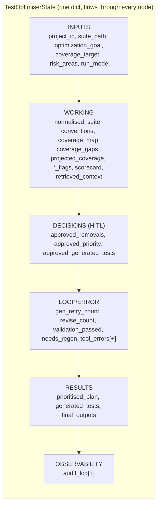
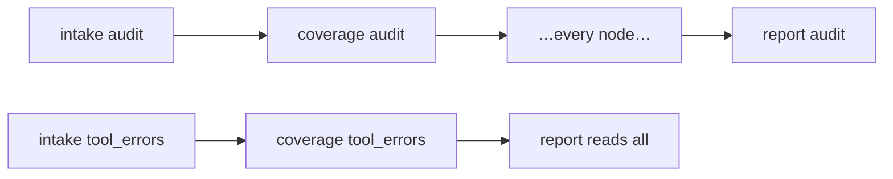

# State Flow

The lifecycle of the shared `TestOptimiserState` — every field, which node reads it, which node
writes it, and how it accumulates from initial inputs to `final_outputs`. Companion docs:
[EXECUTION_FLOW.md](EXECUTION_FLOW.md), [DATA_FLOW.md](DATA_FLOW.md),
[FUNCTION_CALL_MAP.md](FUNCTION_CALL_MAP.md). Schema source: [../src/state.py](../src/state.py).

---

## 1. How state works

`TestOptimiserState` is a `TypedDict(total=False)` — the single "clipboard" passed through the
graph. Rules:

- A node reads any keys it needs and **returns only the keys it changed**; LangGraph merges the
  returned dict into the running state.
- Two fields are **append-only** via `Annotated[list, add]`: `audit_log` and `tool_errors`. Every
  node contributes; entries accumulate, never overwrite.
- All other fields are **last-writer-wins** (overwritten by whichever node returns them).



---

## 2. Field-by-field lifecycle

`[+]` = append-only. **Init** = set by `main.initial_state` / `api` request.

| Field | Written by | Read by | Notes |
|-------|-----------|---------|-------|
| `project_id` | Init | retrieval, hitl_*, prioritisation, report | memory key |
| `suite_path` / `raw_suite` | Init | intake | source of the suite |
| `optimization_goal` | Init | prioritisation | speed/coverage/reliability/cost |
| `coverage_target` | Init | coverage_floor_gate | default `0.80` |
| `risk_areas` | Init | coverage, prioritisation, revise, hitl_removals (via `is_protected`) | pins protected tests |
| `run_mode` | Init | hitl_removals, hitl_priority, hitl_generated | interactive/automated |
| `additional_context` | Init | (reserved) | |
| `normalised_suite` | intake | coverage, redundancy, retrieval, scoring, prioritisation, revise, assemble | the parsed suite |
| `conventions` | intake | gap_gen | style for generated tests |
| `coverage_map` | coverage | scoring, prioritisation, report | criterion → [test_ids] |
| `coverage_gaps` | coverage | scoring, gap_gen, report | ranked risk-first |
| `projected_coverage` | coverage, prioritisation, revise | coverage_floor_gate, assemble, report | recomputed as removals change |
| `redundancy_flags` | redundancy | scoring, prioritisation, revise, hitl_removals, assemble, report | merge candidates |
| `flakiness_flags` | redundancy | scoring, hitl_removals, report | with evidence |
| `slow_flags` | redundancy | scoring, prioritisation (`_tier_for`), report | ≥ `SLOW_TEST_SECONDS` |
| `retrieved_context` | retrieval | report (`context_sources`) | RAG hits |
| `scorecard` | scoring | report | 6 dimensions |
| `approved_removals` | hitl_removals, **revise** | prioritisation, revise, assemble, report | pinned tests filtered out |
| `approved_priority` | retrieval (init `{}`), hitl_priority | (carried) | approved tiering |
| `approved_generated_tests` | hitl_generated | assemble, report | kept drafts |
| `gen_retry_count` | Init `0`, gap_gen (++) | route_after_validation | caps loop at `MAX_GEN_RETRIES` |
| `revise_count` | revise (++) | coverage_floor_gate | caps at `MAX_REVISE_ITERS` |
| `validation_passed` | validation, drop_failing | route_after_validation | loop router flag |
| `needs_regen` | gap_gen, validation | (informational) | |
| `tool_errors` `[+]` | intake, coverage, retrieval, scoring, gap_gen | report | degrade surfacing |
| `prioritised_plan` | prioritisation | hitl_priority, assemble | tiers + ranking + goal |
| `generated_tests` | gap_gen, validation, drop_failing | hitl_generated, (report via approved) | drafts + validity |
| `final_outputs` | assemble, report | main/api (returned & written) | the 4 deliverables |
| `audit_log` `[+]` | **every node** | report (embeds full trail), api `GET /runs/{id}` | append-only trace |

---

## 3. Per-node input/output state

```mermaid
flowchart TD
    START([init: project_id, suite_path, goal, coverage_target, risk_areas, run_mode, gen_retry_count=0, audit_log=[], tool_errors=[]])
    START --> intake
    intake["intake<br/>IN: suite_path/raw_suite<br/>OUT: normalised_suite, conventions, tool_errors[+], audit_log[+]"]
    coverage["coverage<br/>IN: normalised_suite, risk_areas, project_id<br/>OUT: coverage_map, coverage_gaps, projected_coverage, tool_errors[+]"]
    redundancy["redundancy<br/>IN: normalised_suite<br/>OUT: redundancy_flags, flakiness_flags, slow_flags"]
    retrieval["retrieval<br/>IN: project_id, normalised_suite, approved_priority<br/>OUT: retrieved_context, approved_priority, tool_errors[+]"]
    scoring["scoring<br/>IN: coverage_map, *_gaps, *_flags, projected_coverage, normalised_suite<br/>OUT: scorecard, tool_errors[+]"]
    h1["hitl_removals<br/>IN: flakiness_flags, redundancy_flags, risk_areas, project_id, run_mode<br/>OUT: approved_removals"]
    prio["prioritisation<br/>IN: goal, normalised_suite, approved_removals, coverage_map, slow_flags, redundancy_flags<br/>OUT: prioritised_plan, projected_coverage"]
    rev["revise<br/>IN: normalised_suite, approved_removals, redundancy_flags, revise_count, risk_areas<br/>OUT: approved_removals, projected_coverage, revise_count"]
    h2["hitl_priority<br/>IN: prioritised_plan, projected_coverage, run_mode<br/>OUT: approved_priority"]
    gap["gap_gen<br/>IN: coverage_gaps, conventions, gen_retry_count<br/>OUT: generated_tests, gen_retry_count++, needs_regen, tool_errors[+]"]
    val["validation<br/>IN: generated_tests<br/>OUT: generated_tests, validation_passed, needs_regen"]
    drop["drop_failing<br/>IN: generated_tests<br/>OUT: generated_tests, validation_passed=True"]
    h3["hitl_generated<br/>IN: generated_tests, run_mode<br/>OUT: approved_generated_tests"]
    asm["assemble<br/>IN: normalised_suite, approved_removals, redundancy_flags, prioritised_plan, approved_generated_tests, projected_coverage<br/>OUT: final_outputs.optimised_plan"]
    rep["report<br/>IN: scorecard, coverage_*, *_flags, retrieved_context, approved_*, tool_errors, project_id<br/>OUT: final_outputs (all 4), audit_log[+]"]

    intake-->coverage-->redundancy-->retrieval-->scoring-->h1-->prio
    prio-->rev-->h2
    prio-->h2
    h2-->gap-->val
    val-->h3
    val-->gap
    val-->drop-->h3
    h3-->asm-->rep-->END([final_outputs])
```

Every node also appends to `audit_log[+]` — omitted above except where it's the node's headline.

---

## 4. State mutations in the two loops

**Generation loop** — `gen_retry_count` is the guard:
```
gap_gen:  gen_retry_count += 1 ; writes generated_tests
validation: writes validation_passed, tags generated_tests[valid]
route_after_validation: reads validation_passed, gen_retry_count
   valid              → approve_tests
   invalid & count<3  → gap_gen (count climbs)
   invalid & count≥3  → drop_failing (sets validation_passed=True → proceeds)
```

**Coverage-floor loop** — `approved_removals` shrinks, `projected_coverage` climbs, `revise_count`
guards:
```
prioritisation: writes projected_coverage
coverage_floor_gate: proj < target → revise
revise: reverts best removal → approved_removals shrinks, projected_coverage↑, revise_count++
coverage_floor_gate: re-check … until proj ≥ target (or revise_count ≥ MAX_REVISE_ITERS)
```

---

## 5. Append-only fields (invariant)



`audit_log` and `tool_errors` use `Annotated[list, add]`. A node returning
`{"audit_log": [audit(...)]}` **appends** — it does not replace the accumulated list.
`report_node` embeds the full trail into `final_outputs["audit_log"]`; `api.py` exposes it via
`GET /runs/{id}`. **Never** overwrite these (see `tests/test_state.py`).

---

## 6. State-debugging locations

| Symptom | Field / node to inspect |
|---------|-------------------------|
| A downstream node sees stale/empty data | confirm the upstream node returned that key (last-writer-wins) |
| Audit entries missing or duplicated | append-only reducer on `audit_log`; the node's `audit(...)` call |
| Removals include a pinned test | `approved_removals` writers (`hitl_removals`, `revise`) + `is_protected` |
| Loop never exits | `gen_retry_count`/`validation_passed` or `projected_coverage`/`revise_count` |
| Deliverable missing a section | `final_outputs` writers (`assemble`, `report`) and the keys they read |
| Schema drift | `src/state.py` + `tests/test_state.py` |
